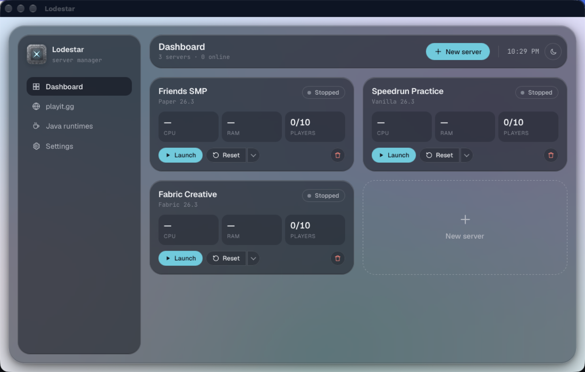

<p align="center">
  
</p>

<h1 align="center">Lodestar</h1>

<p align="center">
  Run Minecraft Java servers on your own computer, for Windows and macOS.
  <br>
  A free, open-source app. No batch files, no Java installs, no port forwarding.
</p>

<p align="center">
  <a href="https://github.com/aeironnsarmiento/Lodestar/releases/latest/download/Lodestar-Windows-Setup.exe"><b>Download for Windows</b></a>
  ·
  <a href="https://github.com/aeironnsarmiento/Lodestar/releases/latest/download/Lodestar-macOS.dmg"><b>Download for macOS</b></a>
</p>

<p align="center">
  
</p>

## Features

- **One-click servers.** Vanilla, Paper, Fabric, Forge and NeoForge, each in its own folder with its own port, settings and worlds. Run several at once.
- **Java handled for you.** The right Java for each Minecraft version is downloaded automatically and shared between servers. Nothing is installed system-wide.
- **Play with friends anywhere.** Link a free [playit.gg](https://playit.gg) account once and every server gets a public address. No router setup.
- **Live dashboard and console.** CPU, RAM and players per server, a searchable console with command history, and one-click op or kick.
- **Mods, plugins and modpacks.** Browse Modrinth inside the app or drag `.jar` files in. Dependencies and updates are handled for you.
- **World resets.** A fresh world with a random or chosen seed in one click, built for speedrun practice. The last 10 worlds are kept.
- **Runs in the background.** Crashed servers restart, scheduled restarts warn players first, the computer stays awake while servers run, and Lodestar can start at login.

## Install

| | Download | Notes |
|---|---|---|
| **Windows 10/11** | [Installer](https://github.com/aeironnsarmiento/Lodestar/releases/latest/download/Lodestar-Windows-Setup.exe) or [portable .exe](https://github.com/aeironnsarmiento/Lodestar/releases/latest/download/Lodestar-Windows-Portable.exe) | The portable `.exe` runs without installing. If SmartScreen says it "protected your PC", choose **More info → Run anyway**. |
| **macOS 11+** (Apple Silicon or Intel) | [Lodestar-macOS.dmg](https://github.com/aeironnsarmiento/Lodestar/releases/latest/download/Lodestar-macOS.dmg) | Drag Lodestar to Applications. On first launch macOS blocks it: go to **System Settings → Privacy & Security → Open Anyway**. |

The app isn't code-signed yet, which is why each OS asks once. All releases are on the [releases page](https://github.com/aeironnsarmiento/Lodestar/releases).

## Use

1. **New server.** Pick a name, type, version and world options. Lodestar downloads Java and the server files; the card shows progress.
2. **Launch.** The first time, accept the [Minecraft EULA](https://aka.ms/MinecraftEULA).
3. **Let friends join.** People on your Wi-Fi use the LAN address on the card (allow Java through the firewall if asked). For everyone else, open **playit.gg** in the sidebar and link your account.

Your servers, worlds and Java live in `%APPDATA%\Lodestar` on Windows and `~/Library/Application Support/Lodestar` on macOS. Uninstalling leaves them; delete that folder to remove everything.

## Build from source

Lodestar is built with [Tauri 2](https://tauri.app) (Rust backend, React + TypeScript frontend). You need Node 22 and Rust, plus the Visual Studio C++ build tools on Windows or the Xcode Command Line Tools on macOS.

```bash
npm install
npm run tauri dev      # run the app
npm test               # frontend tests
cargo test --manifest-path src-tauri/Cargo.toml   # backend tests
npm run tauri build    # installer for this OS
```

On macOS, the playit.gg agent is built from source on the first run (playit.gg publishes no Mac build), which takes about a minute. Tests never download Minecraft, accept the EULA or contact playit.gg.

Pushing a `v*` tag builds both platforms on GitHub Actions and publishes a release.

## License

[MIT](LICENSE)
